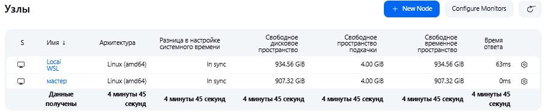
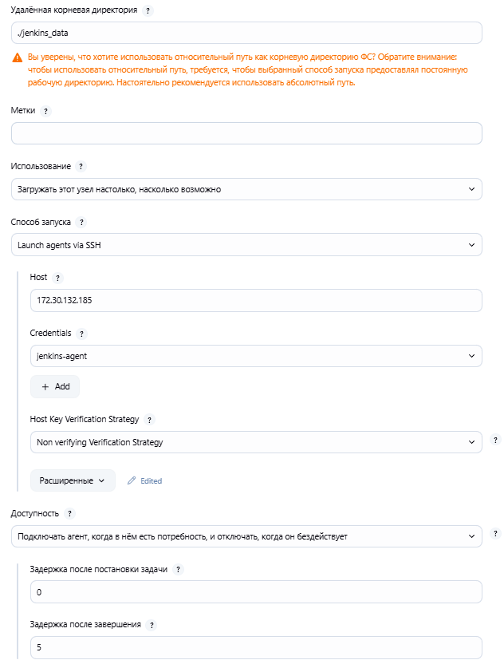
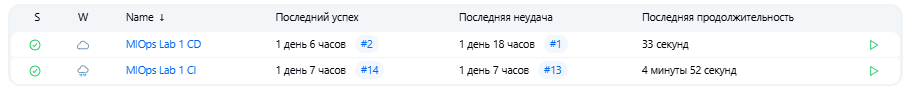

# Отчёт о лабораторной работе №1
#### Домнин Данила

# Задачи

В рамах работы решались следующие задачи:
1. Создать репозитории модели на GitHub, регулярно проводить commit + 
push в ветку разработки, важна история коммитов; 
2. Провести подготовку данных для набора данных, согласно варианту 
задания; 
3. Разработать ML модель с ЛЮБЫМ классическим алгоритмом 
классификации, кластеризации, регрессии и т. д.; 
4. Конвертировать модель из *.ipynb в .py скрипты, реализовать API сервис 
с методом на вывод модели, фронтальная часть по желанию; 
5. Покрыть код тестами, используя любой фреймворк/библиотеку; 
6. Задействовать DVC; 
7. Использовать Docker для создания docker image. 
8. Наполнить дистрибутив конфигурационными файлами: 
- config.ini: гиперпараметры модели; 
- Dockerfile и docker-compose.yml: конфигурация создания 
контейнера и образа модели;  
- requirements.txt: используемые зависимости (библиотеки) и их 
версии; 
- dev_sec_ops.yml: подписи docker образа, хэш последних 5 
коммитов в репозитории модели, степень покрытия тестами 
(необязательно); 
- scenario.json: сценарии тестирования запущенного контейнера 
модели (необязательно). 
9. Создать CI pipeline (Jenkins, Team City, Circle CI и др.) для сборки docker 
image и отправки его на DockerHub, сборка должна автоматически 
стартовать по pull request в основную ветку репозитория модели; 
10. Создать CD pipeline для запуска контейнера и проведения 
функционального тестирования по сценарию, запуск должен стартовать 
по требованию или расписанию или как вызов с последнего этапа CI 
pipeline; 
11. Результаты функционального тестирования и скрипты конфигурации 
CI/CD pipeline приложить к отчёту.

В качестве набора данных используется набор по предсказанию стоимости домов (https://www.kaggle.com/c/boston-housing)

# Ход работы

## 1. ML решение

Для обучения модели была использована библиотека Fedot (https://github.com/aimclub/FEDOT) для создания AutoML решения. 
Эксперименты с библиотекой по созданию ML решения представлены в Jupiter Notebook в [notebooks/test_fedot.ipynb](../notebooks/test_fedot.ipynb)

После обкатки технологии были написаны Python модули [src/train.py](../src/train.py) и [src/predict.py](../src/predict.py)
для реализации обучения и предсказания стоимости домов с помощью AutoML модели.

## 2. API

Для возможности использования сторонними пользователями AutoML модели предсказания стоимости домов было реализовано
WebAPI с помощью фреймворка FastAPI, взаимодействие с которым доступно через Swagger интерфейс после развертывания.
В [src/api.py](../src/api.py) описаны базовые ручки, а в [api_methods.py](../api_methods.py) реализованы методы API.

## 3. DVC

В рамках проекта используется .dvс для версионирования наборов данных, моделей, и запуска экспериментов. 
`.dvc` файлы данных хранятся в [data/datasets](../data/datasets), а `dvc.yaml` pipeline обучения модели в 
[experiments/boston-housing](../experiments/boston-housing) 

Для сохранения данных dvc удалённо используется Minio, поднятая на локальной машине и видимая как из среды разработки, 
так и из машины агента Jenkins. Внутри Minio создана корзина `dvc` для хранения кеша dvc

Скрипт для поднятия Minio:
```shell
docker run -p 9001:9001 -p 9000:9000 --name devops-lab-minio -e "MINIO_ROOT_USER=..." -e "MINIO_ROOT_PASSWORD=..." \
    -v devops-lab-minio-data:/data quay.io/minio/minio server /data --console-address ":9001"
```

Настройка .dvc для работы с Minio производится следующим образом
```shell
dvc remote add -d minio s3://dvc
dvc remote modify --local minio endpointurl http://...
dvc remote modify --local minio access_key_id "${MINIO_ROOT_USER}"
dvc remote modify --local minio secret_access_key "${MINIO_ROOT_PASSWORD}"
```

Закешированные файлы в DVC также получаются во время CI процесса для загрузки данных о датасетах и предобученных 
моделях внутрь образа

## 4. Unit и функциональные тесты

Для тестирования кода были использованы unit тесты, представленные в [src/unit_tests](../src/unit_tests).

Для запуска используются следующие команды:
```shell
coverage run -m unittest discover -s src/unit_tests -p '*_test.py'
coverage report -mi
```
Результат покрытия тестами кода представлен в отчёне тиже
```shell
Name                                 Stmts   Miss  Cover   Missing
------------------------------------------------------------------
src\api_methods.py                      80     11    86%   36, 38, 44, 73, 93, 103-107, 131
src\config.py                            3      0   100%
src\dataloaders.py                       6      0   100%
src\logger.py                           47      5    89%   68-70, 85, 91
src\predict.py                          16      0   100%
src\train.py                            90     31    66%   54, 99-104, 138, 155, 164, 174-180, 192-200, 204-221
src\unit_tests\api_methods_test.py      45      2    96%   49, 70
src\utils.py                            23      1    96%   28
------------------------------------------------------------------
TOTAL                                  310     50    84%
```

Пример и данные для функционального теста представлены в папке [tests](../tests)

## 5. Docker compose

Для реализации развёртки WebAPI в отельном контейнере используется Docker. Для автоматической развертки сервиса были 
написаны docker-compose.yaml и Dockerfile файлы.

# 6. CI/CD

Для реализации CI/CD процессов используется Jenkins, развернутый в отдельном Docker контейнере. 

```shell
docker run --name jenkins-docker --detach --privileged --network jenkins --network-alias docker \
    --volume jenkins-data:/var/jenkins_home -p 9018:8080 jenkins/jenkins
```

В качестве машины для развёртки используется удалённый (находящийся в WSL на Ubuntu 22.04 машине) агент, 
доступ к которому происходит через SSH. \
В результате на стороне Jenkins имеется 2 узла - master и agent, на последнем из которых и производятся все CI/CD процессы.



Настройки удалённого агента представлены на изображении ниже.



Для CI и CD процессов были написаны скрипты на языке groovy, которые могут быть запущены на Linux машине с помощью 
Jenkins. Данные скрипты хранятся в [.jenkins](../.jenkins) директории и подтягиваются Jenkins автоматически из main 
ветки проекта на GitHub.

Результаты сборок представлены на изображении ниже.



В рамках CI процессов происходит: получение актуального кода из GitHub, сборка проекта через docker compose, проверка
запуска и health сервисов, запуск и проверка unit тестов, отправка образа WebAPI сервиса в DockerHub

В рамках CD процессов происходит: получение актуального кода из GitHub (ради docker-compose.yaml), 
получение образов из DockerHub, запуск проекта через docker compose.

## Extra. Настройка удалённой WSL машины

В качестве образа используется Ubuntu 24.04 совместно с WSL 2.

Настройка окружения на
```shell
sudo apt update 
sudo apt install -y curl software-properties-common ca-certificates apt-transport-http tree
```
(при возникновении ошибки установки `apt-transport-http` можно воспользоваться `apt-get`: `sudo apt-get -y install apt-transport-https`)

Java машина для Jenkins agent
```shell
sudo apt install -y fontconfig openjdk-17-jre
```

Установка Docker https://timeweb.cloud/tutorials/docker/kak-ustanovit-docker-na-ubuntu-22-04```shell
```shell
wget -O- https://download.docker.com/linux/ubuntu/gpg | gpg --dearmor | sudo tee /etc/apt/keyrings/docker.gpg > /dev/null
echo "deb [arch=amd64 signed-by=/etc/apt/keyrings/docker.gpg] https://download.docker.com/linux/ubuntu jammy stable"| sudo tee /etc/apt/sources.list.d/docker.list > /dev/null
sudo apt update
apt-cache policy docker-ce
sudo apt install docker-ce
sudo systemctl status docker
```

Настроим агента Jenkins
```shell
sudo adduser jenkins-agent
sudo usermod -aG docker jenkins-agent
```

Настроим SSH
```shell
...  # Добавление ключа ssh в /home/jenkins-agent/.ssh
sudo apt install ufw openssh-server
sudo ufw enable 
service ssh start
sudo ufw allow ssh  # Разрешаем доступ для брандмауэра
```

Настроим dvc
```shell
sudo snap install --classic dvc
```
