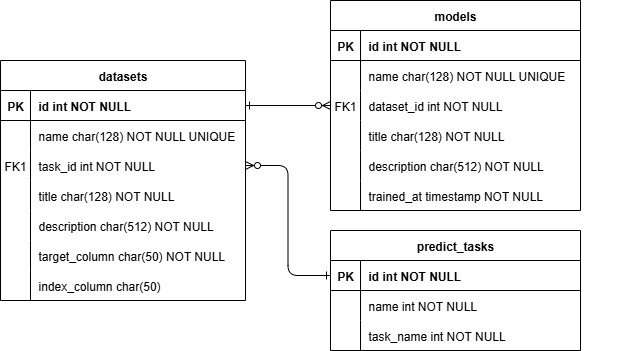

# Отчёт о лабораторной работе №2
#### Домнин Данила

# Задачи

В рамах работы решались следующие задачи:
1. Создать репозитории-форк модели на GitHub, созданной в рамках 
лабораторной работы №1, регулярно проводить commit + push в ветку 
разработки, важна история коммитов. 
2. Реализовать взаимодействие сервиса модели и базы данных, согласно 
варианту задания. 
3. Обеспечить процессы аутентификации/авторизации при обращении 
сервиса модели к базе данных в момент отправки результата работы 
модели. В исходном коде не должно быть явно прописаны пары 
логин/пароль, адрес/порт сервера базы данных, токены доступа. 
4. Возможно наполнить базу данных наборами для обучения/валидации 
модели. 
5. Переиспользовать CI pipeline (Jenkins, Team City, Circle CI и др.) для 
сборки docker image и отправки их на DockerHub. 
6. Переиспользовать CD pipeline для запуска контейнеров и проведения 
функционального тестирования по сценарию, запуск должен стартовать 
по требованию или расписанию или как вызов с последнего этапа CI 
pipeline. 
1 
7. Результаты функционального тестирования и скрипты конфигурации 
CI/CD pipeline приложить к отчёту.

# Ход работы

# 1. База данных

## 1.1 Сущности

В рамках работы были выделены следующие основные сущности, через которые система и конечные пользователи смогли бы решать свои задачи.

#### Dataset
Описывает наборы данных, используемых для обучения моделей. Состоит из:
- id: Идентификатор набора данных
- name: Системное название набора данных
- title: Человеко-читаемое название набора данных
- description: Человеко-читаемое описание набора данных
- task_id: Идентификатор задачи
- target_column: Название целевой колонки
- index_column: Название колонки индекса

#### Models
Описывает уже обученные ML модели на определённых наборах данных. Состоит из:
- id: Идентификатор модели
- name: Системное название модели
- title: Человеко-читаемое название модели
- description: Человеко-читаемое описание модели
- dataset_id: Идентификатор набора данных, на котором обучена модель
- trained_at: Время когда модель была обучена

#### Predict tasks
Описывает доступные в системе задачи предсказания (классификация, регрессия). Состоит из:
- id: Идентификатор задачи
- name: Системное название задачи
- title: Человеко-читаемое название задачи

Схема организации сущностей в базе данных представлена на следующей диаграмме.


## 1.2 Реализация взаимодействия

Для взаимодействия API приложения и базы данных была выбрана SQLAlchemy ввиду её популярности и универсальности. Сущности были описаны с помощью ORM моделей SQLAlchemy и представлены в модуле [database/models](../src/database/models/). Взаимодействие с базой данных проводится с помощью универсального интерфейса [`ModelRepository`](../src/database/repository.py), что позволяет отделить логику запроса к базе данных от клиентской бизнес логики. Обращение к базе данных является I/O Bound задачей, поэтому все операции в `ModelRepository` выполняются асинхронно.

Более подробно с кодом взаимодействия с базой можно ознакомится в разделе [database](../src/database/).

## 1.3 SQL Server

В рамках номера варианта работы требовалось реализовать работу с базой данных MSSQL. Но в процессе работы с этим сервером возникло много проблем. 

Причиной, по которой от этого сервера пришлось отказаться - это проблема с установкой драйверов. Для работы с MSSQL в SQLAlchemy существуют диалекты на базе ODBC. К сожалению, ODBC из коробки не поставляется с нужными драйверами, из за чего при работе с базой возникает следующая ошибка:  
```
(pyodbc.InterfaceError) ('IM002', '[IM002] [unixODBC][Driver Manager]Data source name not found and no default driver specified (0) (SQLDriverConnect)')
```
Для решения этой проблемы потребовалось бы во время сборки образа скачивать драйвера с сайта Microsoft.

Поэтому для упрощения развертывания базы было решено отказаться от работы с MSSQL в пользу PostgreSQL, который работает сразу из коробки. При этом, ввиду работы с SQLAlchemy, приложение не зависит от конкретного типа базы данных и сохраняет возможность изменить его в дальнейшем, если это потребуется.  

## 1.4 Инициализация и миграция

Для проведения первичной инициализации и последующей миграции таблиц в базе данных используется библиотека Alembic.

Ввиду того, что база данных запускается в рамках Docker сети, было решено производить создание миграций также с помощью контейнера в рамках существующей сети. Для этого создается и запускается контейнер на основе изображения API (для доступа к моделям и настройкам) с изменённой entrypoint на выполнение `alembic revision`.

Для удобстав создание миграций было вынесено в отдельные скрипты для [Windows](../scripts/run_alembic_revision.bat) и [Linux](../scripts/run_alembic_revision.sh).

Для актуализации базы данных проведение миграции запускается каждый раз при старте API и зашито в его entrypoint c помощью `alembic upgrade head`.

## 1.5 Заполнение начальными значениями

Текущее приложение поставляется с уже предобученными моделями, наборами данных и фиксированными задачами. Поэтому необходимо автозаполнение как пустой базы данных, так и возможная актуализация текущих записей. 

Для этого были добавлены функции заполнения базы актуальными значениями с помощью отдельных функций, интегрированных в приложение. Их запуск производится в секции `lifespan` при старте приложения. 

Более подробно с функциями автозаполнения можно ознакомиться в разделе [database/seeders](../src/database/seeders/).

# 2. Изменения в API

## 2.1 Соответствия лучшим практикам

Для повышения читаемости и чистоты кода был проведён рефакторинг API, а именно:
- Вынесение кода для работы с кончеными точками API в модуль [routers](../src/routes/);
- Инициализация настроек с помощью библиотеки `pydantic-settings`, что позволило изменять любые настройки с помощью переменных среды ([config.py](../src/config.py));
- Обертка выходов конечных точек API в `Pydantic` модели и добавление информации о возможных кодах ответов, что позволило генерировать качественную документацию API;
- Реализация внедрения зависимостей с помощью механизма `Dependency Injection` в `FastAPI`, что позволило получать сессии базы данных в рамках выполнения одной конечной точки ([dependencies.py](../src/dependencies.py))

## 2.2 Изменение конечных точек

Ввиду выделения конкретных сущностей в приложении была изменена структура конечных точек API для взаимодействия с этими сущностями в соответствии с принципами REST.

## 2.3 End-to-end тестирование

Ввиду внедрение внешних зависимостей, таких как база данных, для тестирования приложения было решено перейти от unit тестов к end-to-end тестам с помощью `pytest` и `FastAPI Client`. 

Тестирование затрагивает все конечные точки с различными корректными и не корректными параметрами и состоит из 17 тестов. Ознакомиться с тестами можно в модуле [`tests`](../src/tests/).

Для запуска авто-тестов был составлен отдельный [compose](../src/docker-compose.autotest.yaml) файл, который запускается следующим образом:
```shell
docker compose \
    -f docker-compose.autotest.yaml \
    --env-file .env.autotest \
    up \
    --abort-on-container-exit \
    --exit-code-from api-autotest'
```

По завершению тестирования был получен следующий coverage report (преобразован в таблицу markdown):
| Name                                         | Stmts | Miss | Cover |
|----------------------------------------------|-------|------|-------|
| src/api.py                                   | 25    | 1    | 96%   |
| src/api_methods.py                           | 0     | 0    | 100%  |
| src/config.py                                | 65    | 1    | 98%   |
| src/core/logger.py                           | 47    | 5    | 89%   |
| src/core/predict.py                          | 39    | 12   | 69%   |
| src/database/models/\_\_init\_\_.py          | 4     | 0    | 100%  |
| src/database/models/base.py                  | 3     | 0    | 100%  |
| src/database/models/dataset.py               | 24    | 0    | 100%  |
| src/database/models/mlmodel.py               | 23    | 0    | 100%  |
| src/database/models/task.py                  | 13    | 0    | 100%  |
| src/database/repository.py                   | 64    | 20   | 69%   |
| src/database/seeders/\_\_init\_\_.py         | 3     | 0    | 100%  |
| src/database/seeders/seed_datasets.py        | 34    | 11   | 68%   |
| src/database/seeders/seed_mlmodles.py        | 38    | 11   | 71%   |
| src/database/seeders/seed_predict_tasks.py   | 12    | 0    | 100%  |
| src/database/session.py                      | 20    | 6    | 70%   |
| src/dependencies.py                          | 20    | 1    | 95%   |
| src/routes/\_\_init\_\_.py                   | 0     | 0    | 100%  |
| src/routes/datasets/router.py                | 22    | 4    | 82%   |
| src/routes/datasets/schemas.py               | 17    | 0    | 100%  |
| src/routes/health/router.py                  | 10    | 3    | 70%   |
| src/routes/health/schemas.py                 | 13    | 0    | 100%  |
| src/routes/mlmodels/router.py                | 22    | 4    | 82%   |
| src/routes/mlmodels/schemas.py               | 16    | 0    | 100%  |
| src/routes/predict/router.py                 | 34    | 5    | 85%   |
| src/routes/predict/schemas.py                | 10    | 0    | 100%  |
| src/routes/predict/service.py                | 33    | 1    | 97%   |
| src/routes/router.py                         | 13    | 0    | 100%  |
| src/routes/tasks/router.py                   | 24    | 4    | 83%   |
| src/routes/tasks/schemas.py                  | 8     | 0    | 100%  |
| src/schemas.py                               | 3     | 0    | 100%  |
| src/tests/conftest.py                        | 28    | 0    | 100%  |
| src/tests/routes/test_dataset.py             | 31    | 0    | 100%  |
| src/tests/routes/test_mlmodels.py            | 30    | 0    | 100%  |
| src/tests/routes/test_predict.py             | 43    | 0    | 100%  |
| src/tests/routes/test_tasks.py               | 30    | 0    | 100%  |
| src/utils.py                                 | 8     | 2    | 75%   |
| **TOTAL**                                    | 829   | 91   | 89%   |
| 17 passed, 5 warnings in 7.68s |

# 3. Изменения в GIT

Начиная с текущей работы текущий репозиторий был преобразован в соответствие парадигме `Git Flow`. Для этого было проведено разделение на `master` и `develop` ветки, где `master` содержит релизные версии проекта, а `develop` - версии в разработки и с множеством мелких коммитов. Ввиду отсутствия дополнительных разработчиков создание отдельных `feature/<name>` веток не производилось. 

# 4. Изменения в CI/CD

Для обеспечения корректного функционирования CI/CD процессов с помощью Jenkins было реализовано следующее:
- Внедрены секреты базы данных в CI и CD процессы;
- Изменён способ запуска авто-тестов в СI;
- Преобразован CI процесс для работы с multibranch pipline в рамках единого файла;
- Добавлено условие на отправку образа в DockerHub только при работе с `master` веткой, т.к. CD процесс в рамках текущего приложения подразумевает работу только с релизной версией проекта;
- Внедрено изменение имени собираемого образа API и префикса сетей и контейнеров в зависимости от ветки для избежания конфликтов между сборками.
