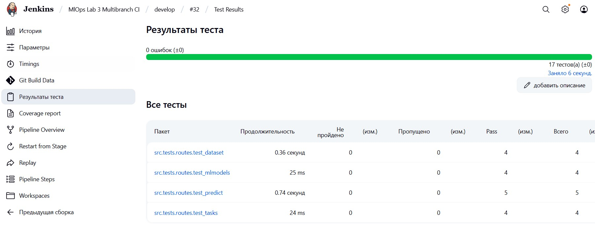
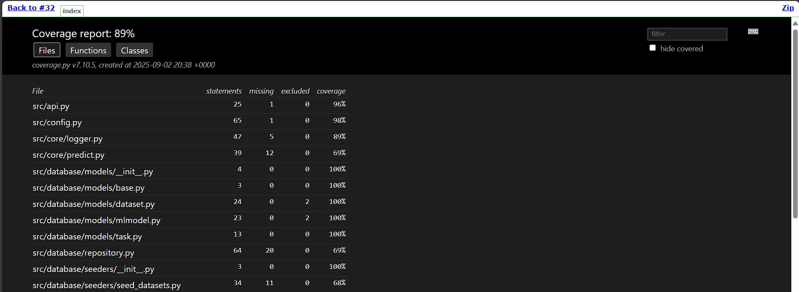

# Отчёт о лабораторной работе №2
#### Домнин Данила

# Задачи

В рамах работы решались следующие задачи:
1. Создать репозитории-форк модели на GitHub, созданной в рамках 
лабораторной работы №2, регулярно проводить commit + push в ветку 
разработки, важна история коммитов. 
2. Настроить хранилище секретов согласно варианту: 
• можно добавить 3-й контейнер с хранилищем; 
• можно встроить взаимодействие в сервис с моделью. 
3. Реализовать взаимодействие следующим образом: 
• разместить данные для авторизации (секреты) в хранилище 
секретов; 
• реализовать получение секретов при обращении к сервису БД; 
• удалить локальные конфигурационные файлы, содержащие 
секреты. 
4. Инициализация сервиса хранилища секретов должна проходить на этапе 
сборки контейнера, допускается хардкод параметров и добавление их в 
.gitignore. 
5. Переиспользовать CI pipeline (Jenkins, Team City, Circle CI и др.) для 
сборки docker image и отправки их на DockerHub. 
6. Переиспользовать CD pipeline для запуска контейнеров и проведения 
функционального тестирования по сценарию, запуск должен стартовать 
по требованию или расписанию или как вызов с последнего этапа CI 
pipeline. 
7. Результаты функционального тестирования и скрипты конфигурации 
CI/CD pipeline приложить к отчёту.

# Ход работы

# 1. Установка Ansible в системе и на агенте

Для работы с Ansible Vaults необходимо установить на агенте и в системе, где будут шифроваться vaults. Ввиду того, что для Windows установка ansible не поддерживается, шифрование vaults будет происходить в WSL Ubuntu 24.04.

Для установки Ansible следует обратиться к [документации](https://docs.ansible.com/ansible/latest/installation_guide/installation_distros.html). Для Ubuntu 24.04 установка выполняется следующим образом:

```shell
$ sudo apt update
$ sudo apt install software-properties-common
$ sudo add-apt-repository --yes --update ppa:ansible/ansible
$ sudo apt install ansible
```

# 2. Ansible Vaults

Для регистрации секретов на машине с установленным Ansible были созданы yaml файлы (отдельно для prod и dev версий), содержащие секреты для подключения к базе данных. Пример содержимого файлов:

```yaml
vault_app_db_user: <some-user>
vault_app_db_password: <some-password>
```

Для зашифровки были использованы сгенерированные пароли, различающиеся для dev и prod версий. Зашифровка файлов производилась следующими командами с ручным вводом пароля (считаем, что среда разработки безопасна и не содержит keylogger'ов):

```shell
ansible-vault encrypt vault.dev.yaml
ansible-vault encrypt vault.prod.yaml
```

Полученные файлы секретов были помещены в [playbooks/vars/app_database](../playbooks/vars/app_database) и залиты в репозиторий. Ссылка на эти vault переменные используются в файле [vars.yaml](`playbooks/vars/app_database/vars.yaml`)

# 2. Ansible playbooks

Для бесшовной работы с Ansible Vaults были составлены Ansible playbooks для выполнения основных сценариев работы с репозиторием. 

Playbooks были разделены на логические этапы для соответствия стадиям CI/CD pipeline и выполняются на локальной машине. Ознакомиться с playbooks можно ознакомиться в модуле [playbooks](../playbooks).

Для выполнения шаблонных взаимодействий с репозиторием были выделены отдельные роли, такие как сборка, тесты, поднятие и остановка сервисов. Роли представляют из себя набор задач (`tasks/main.yaml`) и описание роли и используемых ею переменных (`meta/argument_specs.yaml`).

Для хранения переменных приложения, таких как секреты базы данных, используется директория [playbooks/vars](../playbooks/vars), содержащая как зашифрованные vault файлы, так и vars файлы для удобной ссылки на переменные в этих файлах (т.к. файлы зашифрованы - информация о их структуре не доступна).

Для запуска playbook и использования секретов, к примеру для поднятия сервисов, можно воспользоваться следующей командой: 

```shell
ansible-playbook --extra-vars '{"db_vault_file": "vars/app_database/vault.dev.yaml", "wait_timeout": 180}' playbooks/up.yaml
```

При возникновении ошибок при работе с `community.docker.docker_compose_v2` следует обновить пакет до последней версии:

```shell 
ansible-galaxy collection install community.docker --force
```

# 3. Внедрение Ansible playbooks в CI/CD

В связи с переходом на запуск стадий через на Ansible playbooks были изменены CI и CD pipeline. Запуск Ansible playbooks производится через Ansible плагин для Jenkins. 

Ввиду не возможности корректного отображения консольного вывода из задач Ansible, для вывода результатов авто-тестов и отчета о покрытии потребовалось генерировать отчеты в виде файлов в формате junit и html соответственно. Ввиду использования дополнительных плагинов для вывода отчётов в задачах сборки появилась возможность отслеживать как отчёты тестирования, так и отчёты о покрытии.





Для запуска обновлённого CI/CD pipeline необходимо установить в Jenkins плагины [Ansible](https://plugins.jenkins.io/ansible/), [AnsiColor](https://plugins.jenkins.io/ansicolor/) и [HTML Publisher](https://plugins.jenkins.io/htmlpublisher/). 